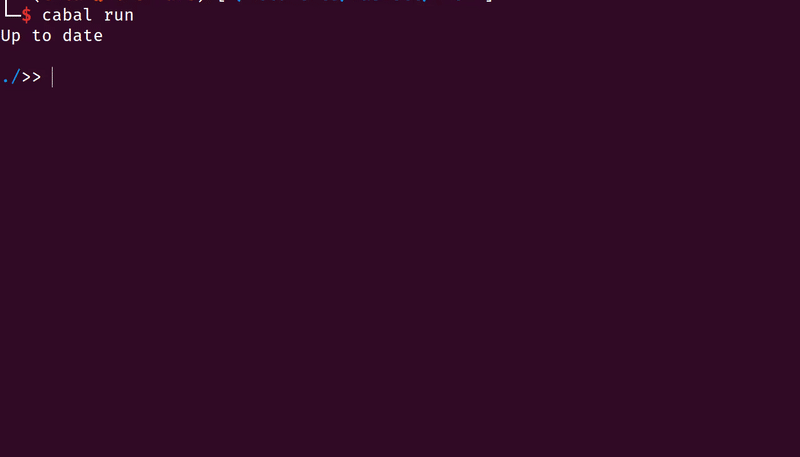

# HTerm
Basic file navigation tool for Linux bash like terminal

# Build 
Requires haskell compiler and cabal 

- Install Haskell Platform (Repo) or through ghcup 
- Install Cabal as build tool 
- Run `cabal run` from project root directory 

# Usage
Just run  
Its more like ivy mode (used by Emacs)  
Supports : 
- ~/ (tilde) -> switch to home directory 
- ../        -> switch to parent directory 
- Tab        -> Directory contents if no match else complete current selection hint 
- Auto execution of file based on its extension (Add the rest yourself)
- Glob-regex based searching   

    
